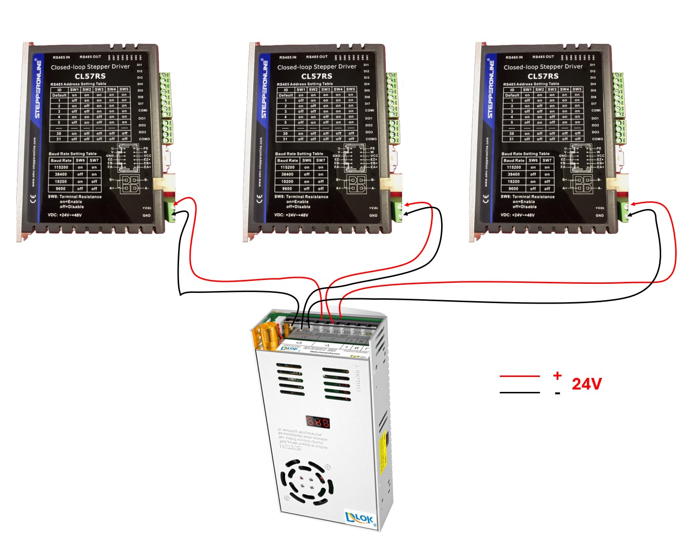
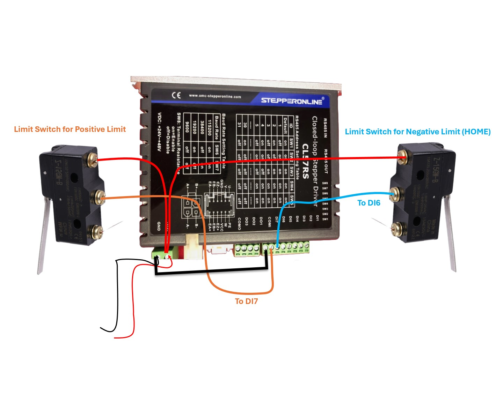
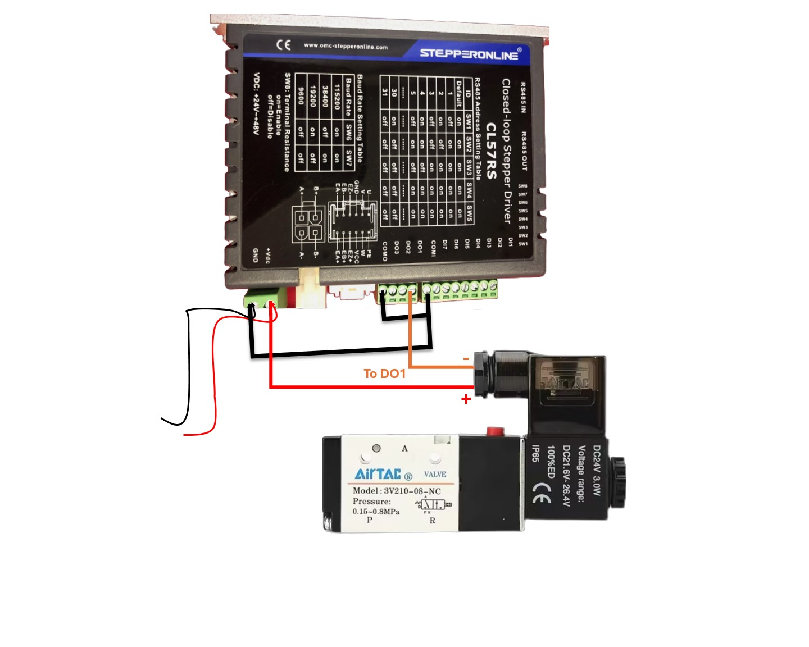
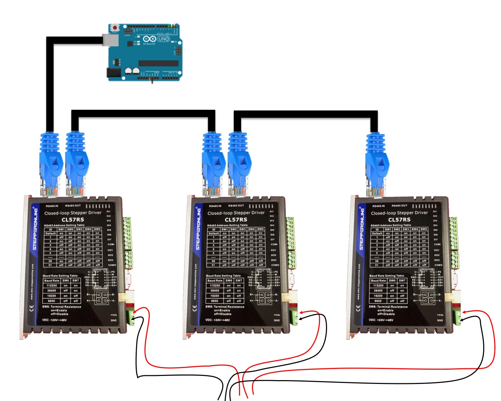
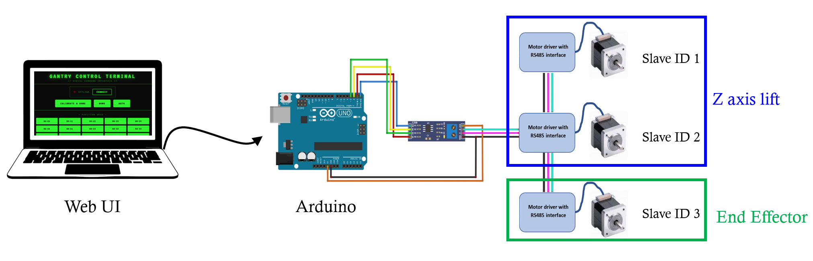
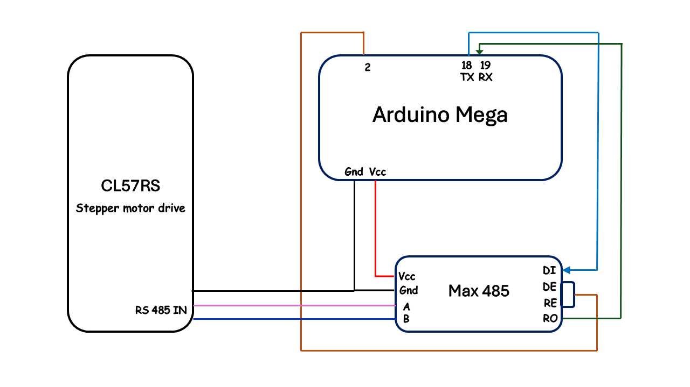

# Wiring

The wiring consists of 4 main stages:

1. Power Supply wiring
2. Limit Switch wiring
3. Nozzle valve wiring
4. Communication Connections
    1. Drivers interconnection (daisy chaining)
    2. PC/Laptop interface communication with drivers via arduino

## 1. Power Supply wiring

The power supply is connected each of the drivers. The power supply is rated for **0-24VDC** and **20A** output.

## 2. Limit Switch wiring

Each axis has two limit switches, one for the negative direction and one for the positive direction. The negative limit switch is connected to the **DI6** terminal of the driver and the positive limit switch is connected to the **DI7** terminal of the driver. Negative limit switch is the one that gets closed when the axis is homed. 

  

## 3. Pneumatic Valve wiring

The pneumatic valve is connected to the **DO1** terminal of the driver connected to **Motor C (ID 3)**. The valve is activated when the axis reaches the target position. Make sure to connect the common port of the output **COMO** of the driver to common port of the input **COMI** of the driver.

  

## 4. Communication Connections
Establishing communication takes place in two stages:

- Establishing communication between the drivers (daisy chaining).
- Establishing communication between PC/Laptop and Arduino to a driver.

#### Communication between drivers (daisy chaining)
To ensure commands from arduino are received by all three drivers, we need to connect them in a daisy chain fashion. The terminal resistance of the last driver should set to **ON** and the terminal resistance of the rest of the drivers should be set to **OFF**.

#### PC/Laptop interface communication with drivers via arduino

Arduino is connected to the Laptop/PC through a serial connection. It communicates with all three drivers through a single MAX485 RS485 transceiver module. The output from MAX485 module is connected to the RS485 A(+), B(-) terminals of the first driver. The other drivers are connected in daisy chain fashion. The arduino is powered by the USB port of the laptop. It can also be powered by an external power supply of 5V.

##### Arduino Mega to MAX485 to Driver

| Arduino Mega Pin | MAX485 Pin | Description                       |
| :--------------- | :--------- | :-------------------------------- |
| **TX1** (Pin 18) | DI         | Transmit data                     |
| **RX1** (Pin 19) | RO         | Receive data                      |
| **Digital 2**    | DE + RE    | Direction control (tied together) |

| MAX485 Terminal | Driver Terminal | Description   |
| :-------------- | :-------------- | :------------ |
| **A (+)**       | RS485-A (+)     | Non-inverting |
| **B (−)**       | RS485-B (−)     | Inverting     |

> ℹ️ If the communication with the driver is not established, interchange the A and B wires and try again.
