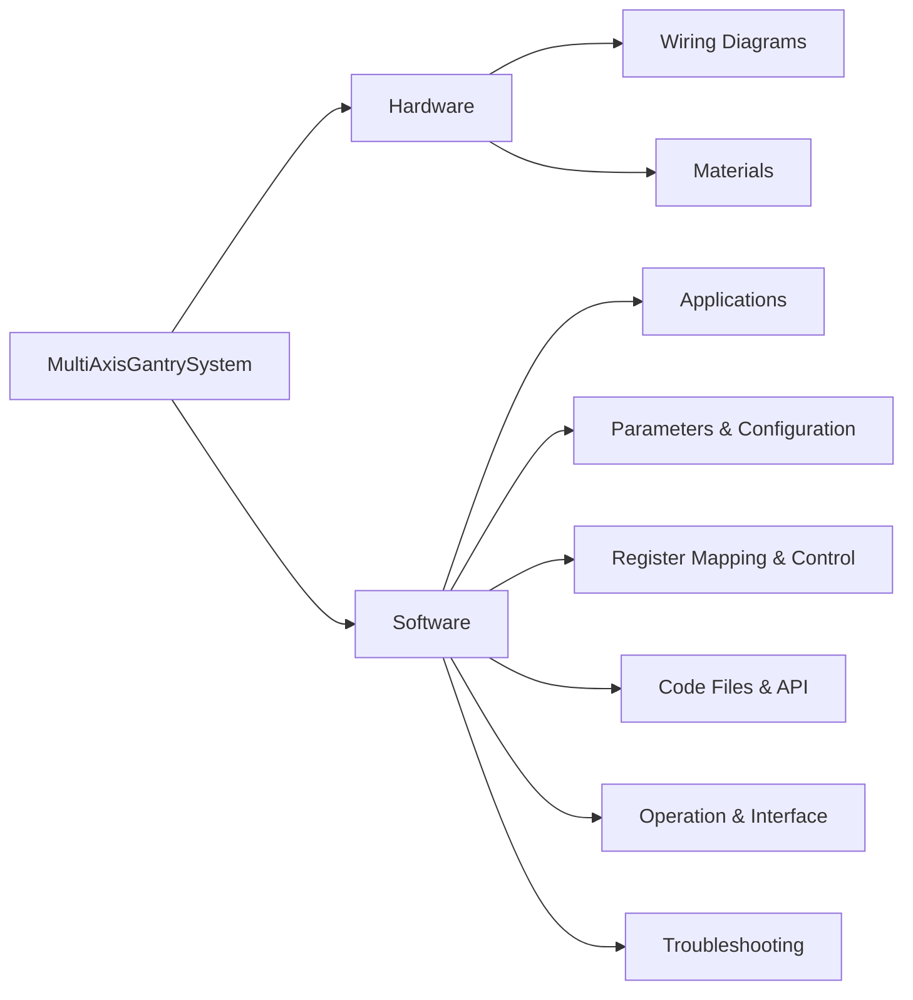

# MultiAxisGantrySystem

Welcome to the documentation for the MultiAxisGantrySystem. This project is a 3-axis gantry system that can be used for various applications. Specifically it is built for clearing the miners of any debris/dust through compressed air. This documentation covers the hardware and software aspects of the system. It includes the wiring diagrams, code files, Operation and other relevant information. 

## Documentation Structure

