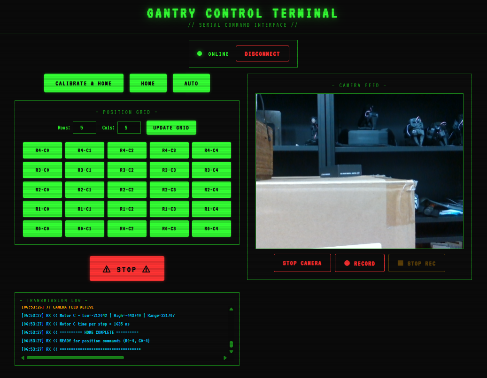
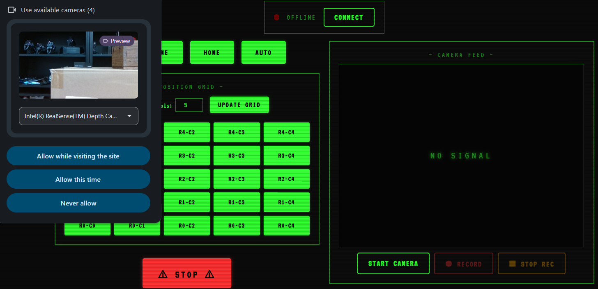
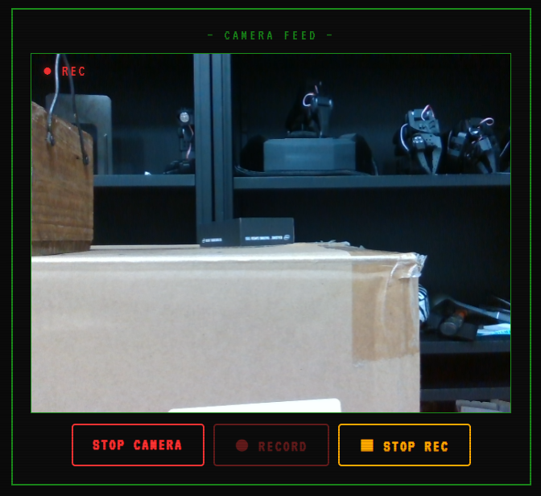
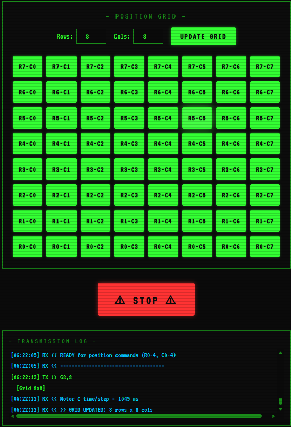
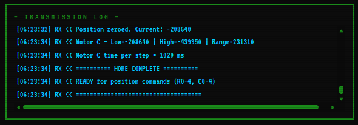
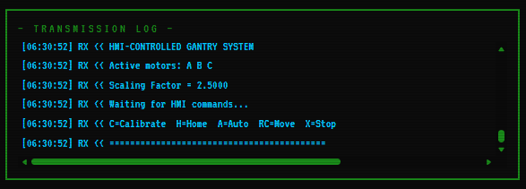

# Operation and Interface


## HMI Web Interface

A browser-based control panel connecting to the Arduino via the **Web Serial API** (Chrome/Edge only). If this page is closed at anytime, we need to connect again and home the system before using it. The interface provides access to the following functionalities: 

1. Home: Homes all the motors to their respective limit switches.
2. Calibration: Calibrates all the motors to their respective limit switches.
3. Manual Positioning: Moves the motors to the desired position.
4. Auto Stepping: Moves the motors in a snake/zigzag pattern across the entire grid.
5. Emergency Stop: Stops all the motors.
6. Camera Feed: Streams live video from a connected webcam.
7. Video Recording: Records camera feed to `.webm` files with timestamped filenames.
8. Grid update: Updates the grid dynamically according to user input.
9. Transmission Log: Logs all the transmission data between the Arduino and the drivers.



## Functionalities
When the system is powered on for the first time, calibration needs to be performed first. After that regular operations can be performed. Once calibrated, the calibration data is saved to EEPROM and can be retrieved later. From next time onwards, we can just home the system and use it. Click on **connect** button and connect to the Arduino. 

> **⚠ Warning:** Opening the Arduino Serial Monitor while the HMI is connected (or vice versa) will reset the Arduino. Use one interface at a time.

### 1. Homing (`H`)

1. Homes all motors to their respective limit switches.
2. Zeros positions.

### 2. Calibration (`C`)

1. Homes all active motors to their respective lower limit switches.
2. Zeros all position counters.
3. Simultaneously jogs all motors toward their upper limit switches.
4. Records upper limit positions and computes travel range for the X and Z axes.
5. Saves calibration data to EEPROM.
6. Re-homes all motors and zeros positions again.

### 3. Manual Positioning (`RC`)

Two-digit serial command: first digit = **row** (Z axis - Motors A/B), second digit = **column** (X axis - Motor C).

- Example: `23` → move to Row 2, Column 3.
- Motors A/B move to the desired row position through vertical motion.
- Motor C moves to the desired column position through horizontal motion.

After Motor C reaches the desired colum position, the valve is activated for a duration set in the config file.

### 4. Auto Stepping (`A`)

Performs a snake/zigzag sweep across the entire grid:

```
Row 1:  C5 ← C4 ← C3 ← C2 ← C1 ← C0    (backward sweep)
Row 0:  C0 → C1 → C2 → C3 → C4 → C5    (forward sweep)
```

After Motor C reaches each of the sequential column positions, the valve is activated for a duration set in the config file. 

### 5. Stop (`X`)

Stops all the motors immediately. Motor C will complete its current move before stopping. (So it doesnt loose track of its position, since it operates in velocity mode).

### 6. Camera Feed

This provides a live feed from the webcam connected to the system. It is useful for monitoring the system and ensuring that it is operating correctly. It also facilitates the recording of videos and saving them immediately to the system.

- Click on the **start camera** button to start the camera feed. It shows the cameras available to stream. Select the desired camera. (Currently supports usb webcams and laptop cameras).
 

### 7. Video Recording

- Click on the **record** button to start recording the camera feed. Recording icon will be visible in the top left corner of the video feed.
- Click on the **stop rec** button to stop recording the camera feed. The video will be saved to the default download directory of the browser.

   

> **Tip:** Set your browser's default download directory to a `recordings/` folder for organized video storage.

### 8. Grid Update

- Change the rows and columns values in the grid. Then, click on the **update grid** button to update the grid. The grid will be updated dynamically according to user input, both on the Interface and the code variables. By default the grid is set to 5x5. Below is an example of deafult grid updated to 8x8.



> <font color="red">**⚠ Important:** </font> When grid is updated on the Interface, (i.e., after clicking **update grid** button), Home the system again before using it, for the changes to take place correctly.  The transmission log window will display the updated grid values. Look for "=======HOME COMPLETE========" message in the transmission log after homing. Then you can use the system.



---

### 9. Transmission Log

This provides a live feed of all the transmission data between the Arduino and the drivers. It is useful for monitoring the system and ensuring that it is operating correctly. 

 


---
