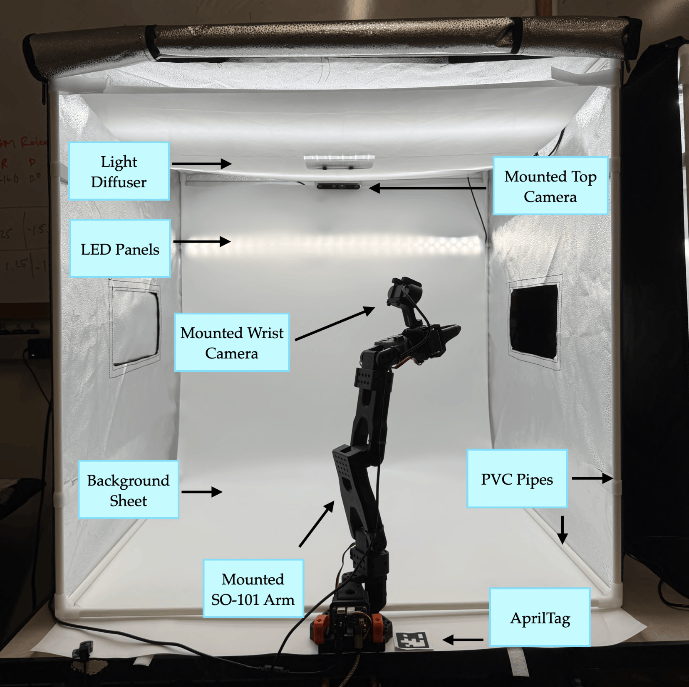

# VLA-REPLICA Setup Guide

[Back to project page](../../index.html)

## Start here

This documentation is organized into separate pages so the setup flow is easier to follow:

- [Bill of materials](bill-of-materials.md)
- [Hardware assembly](hardware-assembly.md)
- [Software installation](software-installation.md)
- [Calibration](calibration.md)
- [Running evaluations](running-evaluations.md)
- [Task reference](task-reference.md)
- [Troubleshooting & checklists](troubleshooting.md)

## Overview & prerequisites

VLA-REPLICA is a low-cost, reproducible real-world benchmark for evaluating vision-language-action
policies on tabletop manipulation tasks. It uses an SO-101 follower arm, a top RealSense camera,
and a wrist RGB camera inside a standardized light box setup.

- Estimated setup time: about 1 hour for the core software + calibration workflow.
- Required background: none; the guide is written for non-experts.
- System requirements: Our system utilizes an i9-10900X, 64GB RAM, and Nvidia A5000 (24GB VRAM). At least 24GB VRAM is recommended for real-time VLA inference, especially with pi0/pi0.5.

<figure style="text-align: center; margin: 20px auto;">
  
  <figcaption style=" color: #555; margin-top: 8px;">
    Benchmark environment. Physical workspace showing the SO-101 follower arm, 32×32 in light box, LED panel, white background sheet, and AprilTag.
  </figcaption>
</figure>

## What is covered

This guide covers the full workflow from hardware assembly through policy evaluation:

1. Gather the hardware and printed parts.
2. Assemble the cameras, light box, and SO-101 platform.
3. Install software and find device indices.
4. Calibrate the arm and cameras.
5. Run benchmark evaluations and compare results.

## Quick notes

- Keep lighting, camera angles, and the background sheet consistent.
- Follow the calibration targets exactly before evaluating policies.
- Use the task reference and troubleshooting pages when setting up scenes.
